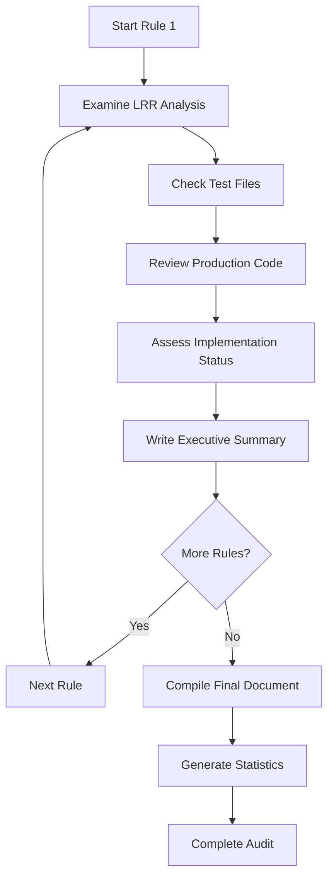

# Design Document

## Overview

This design outlines the systematic approach for conducting a comprehensive manual audit of all 101 LRR rules in the TI4 AI project. The audit will produce a single authoritative document with exactly 101 paragraphs, each providing an executive summary of one rule's implementation status.

## Architecture

### Audit Process Flow



### Information Sources

1. **LRR Analysis Documents** (`.trae/lrr_analysis/`)
   - Primary source for rule understanding
   - Current implementation notes
   - May be outdated or incomplete

2. **Test Files** (`tests/`)
   - Evidence of implemented functionality
   - Coverage indicators
   - Quality assessment data

3. **Production Code** (`src/ti4/`)
   - Actual implementation verification
   - Architecture patterns
   - Integration points

4. **Specification Documents** (`.kiro/specs/`)
   - Planned implementations
   - Design decisions
   - Task completion status

## Components and Interfaces

### Manual Analysis Process

**Purpose:** Human reviewer manually examines each rule's implementation status

**Information to Examine:**
- Rule number (1-101)
- LRR analysis document (if exists)
- Related test files
- Production code modules
- Specification documents

**Manual Tasks for Each Rule:**
- Implementation status classification
- Executive summary paragraph writing
- Priority assessment
- Gap identification

**Manual Process Steps:**
1. Manually locate all relevant files for the rule
2. Manually analyze implementation completeness by reading code
3. Manually cross-reference documentation accuracy
4. Manually identify testing coverage by examining test files
5. Manually assess integration quality
6. Manually write concise summary paragraph

### Status Classification System

**Implementation Categories:**
- **Fully Implemented:** Complete implementation with comprehensive tests
- **Partially Implemented:** Core functionality exists but missing features or tests
- **Spec Only:** Requirements/design exist but no implementation
- **Not Started:** No evidence of implementation or planning

**Priority Levels:**
- **Critical:** Core game mechanics, blocking other implementations
- **High:** Important features affecting gameplay
- **Medium:** Supporting features, quality of life improvements
- **Low:** Edge cases, optimization opportunities

### Manual Document Creation

**Structure:**
```
# TI4 AI Implementation Status Audit
## Executive Summary
[Overall statistics and key findings]

## Rule-by-Rule Analysis
### Rule 1: [Title]
[Implementation status paragraph]

### Rule 2: [Title]
[Implementation status paragraph]

...

### Rule 101: [Title]
[Implementation status paragraph]

## Summary Statistics
[Completion percentages by category]

## Priority Recommendations
[Next steps and critical gaps]
```

## Manual Tracking Structure

### Information to Track Per Rule

For each rule, the reviewer will manually track:
- Rule number and title
- Implementation status (Fully Implemented/Partially Implemented/Spec Only/Not Started)
- Priority level (Critical/High/Medium/Low)
- Whether LRR analysis exists
- Whether tests exist
- Whether implementation exists
- Whether specification exists
- List of relevant test files found
- List of relevant implementation files found
- Identified gaps
- Written summary paragraph

### Overall Audit Tracking

The reviewer will manually maintain:
- Total rules examined (target: 101)
- Count of fully implemented rules
- Count of partially implemented rules
- Count of spec-only rules
- Count of not-started rules
- List of critical gaps identified
- List of high-priority next steps
- All rule summaries

## Error Handling

### Missing Information Scenarios

1. **No LRR Analysis:** Note as documentation gap, examine code directly
2. **No Test Files:** Flag as testing gap, assess implementation quality
3. **No Implementation:** Verify against specifications and mark appropriately
4. **Conflicting Information:** Document discrepancy for resolution

### Quality Assurance

1. **Completeness Check:** Ensure all 101 rules are covered
2. **Consistency Validation:** Verify uniform paragraph structure
3. **Accuracy Verification:** Cross-reference multiple sources
4. **Conciseness Review:** Maintain executive summary brevity

## Testing Strategy

### Audit Process Validation

1. **Sample Rule Deep Dive:** Thoroughly analyze 5-10 rules to establish methodology
2. **Cross-Reference Verification:** Validate findings against known implementations
3. **Stakeholder Review:** Confirm accuracy of status classifications
4. **Documentation Quality:** Ensure summaries are clear and actionable

### Output Quality Assurance

1. **Structure Validation:** Verify exactly 101 paragraphs in numerical order
2. **Content Review:** Ensure each paragraph contains required information
3. **Statistical Accuracy:** Validate summary statistics against individual assessments
4. **Readability Check:** Confirm executive-level accessibility

## Implementation Methodology

### Phase 1: Preparation (Rules 1-10)
- Establish analysis methodology
- Create template structures
- Validate information sources
- Refine assessment criteria

### Phase 2: Core Analysis (Rules 11-90)
- Systematic rule-by-rule examination
- Consistent documentation approach
- Regular quality checks
- Progress tracking

### Phase 3: Completion (Rules 91-101)
- Final rule assessments
- Document compilation
- Statistical generation
- Quality validation

### Phase 4: Review and Finalization
- Comprehensive review of all 101 summaries
- Statistical accuracy verification
- Priority recommendation development
- Final document preparation

## Quality Metrics

### Completeness Indicators
- All 101 rules addressed: ✓/✗
- Consistent paragraph structure: ✓/✗
- Accurate status classifications: ✓/✗
- Comprehensive gap identification: ✓/✗

### Accuracy Measures
- Cross-referenced multiple sources: ✓/✗
- Verified against actual code: ✓/✗
- Validated test coverage claims: ✓/✗
- Confirmed specification alignment: ✓/✗

### Utility Assessment
- Executive-level readability: ✓/✗
- Actionable recommendations: ✓/✗
- Clear priority guidance: ✓/✗
- Comprehensive project overview: ✓/✗

## Deliverable Specifications

### Primary Output: Implementation Status Document
- **Format:** Markdown document
- **Length:** Exactly 101 numbered paragraphs plus summary sections
- **Structure:** Sequential rule order (1-101)
- **Content:** Executive summaries with status, gaps, and priorities

### Supporting Outputs
- **Statistics Summary:** Completion percentages and metrics
- **Priority Matrix:** Critical gaps and recommended next steps
- **Documentation Updates:** List of LRR analysis files needing updates
- **Test Coverage Report:** Identified testing gaps by rule

## Success Criteria

1. **Complete Coverage:** All 101 LRR rules analyzed and documented
2. **Accurate Assessment:** Implementation status verified against actual code
3. **Actionable Insights:** Clear priorities and next steps identified
4. **Quality Documentation:** Executive-level summaries that inform decision-making
5. **Project Clarity:** Comprehensive understanding of current implementation state
