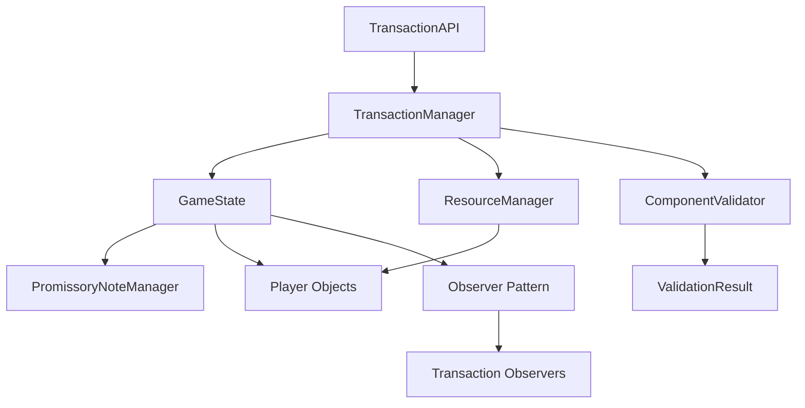

# Design Document

## Overview

This design addresses the 12 critical issues identified in PR 35 code review by implementing systematic fixes for transaction ID uniqueness, atomic operations, immutability, error handling, and test quality. The design focuses on maintaining backward compatibility while improving code robustness and maintainability.

## Architecture

### Core Design Principles

1. **Single Source of Truth**: GameState serves as the authoritative source for all transaction state
2. **Immutability**: All state changes create new objects rather than mutating existing ones
3. **Atomic Operations**: Transaction effects are applied atomically - all succeed or all fail
4. **Defensive Programming**: Validate inputs and handle edge cases explicitly
5. **Separation of Concerns**: Clear boundaries between validation, execution, and state management

### Component Interactions



## Components and Interfaces

### 1. Enhanced GameState Validation

**Purpose**: Prevent duplicate transaction IDs and ensure atomic operations

**Key Methods**:
- `add_pending_transaction()`: Enhanced with duplicate ID validation
- `apply_transaction_effects()`: Reordered for atomic execution
- `_apply_resource_effects()`: Uses deep copying for immutability
- `_apply_promissory_note_effects()`: Proper state cloning

**Implementation Strategy**:
```python
def add_pending_transaction(self, transaction: Any) -> GameState:
    new_pending = self.pending_transactions.copy()
    if transaction.transaction_id in new_pending:
        raise ValueError(f"Pending transaction {transaction.transaction_id} already exists")
    new_pending[transaction.transaction_id] = transaction
    return self._create_new_state(pending_transactions=new_pending)

def apply_transaction_effects(self, transaction: Any) -> GameState:
    # Apply effects first (atomic operation)
    new_state = self._apply_resource_effects(transaction)
    new_state = new_state._apply_promissory_note_effects(transaction)

    # Validate before committing
    if not new_state.is_valid():
        raise ValueError("Transaction effects resulted in invalid game state")

    # Commit to history only after successful effects
    return new_state.complete_transaction(transaction)
```

### 2. Immutable State Management

**Purpose**: Ensure previous states remain unchanged during operations

**Key Changes**:
- Deep copy Player objects before mutation
- Proper PromissoryNoteManager cloning
- Preserve both player hands and available notes

**Implementation Strategy**:
```python
import copy

def _apply_resource_effects(self, transaction: Any) -> GameState:
    new_players = []
    for player in self.players:
        if player.id in [transaction.proposing_player, transaction.target_player]:
            # Work on a deep copy to preserve immutability
            updated_player = copy.deepcopy(player)
            # Apply effects to the copy
            # ... effect application logic
            new_players.append(updated_player)
        else:
            new_players.append(player)
    return self._create_new_state(players=new_players)

def _clone_promissory_manager(self) -> PromissoryNoteManager:
    new_manager = PromissoryNoteManager()
    new_manager._player_hands = {
        pid: hand.copy()
        for pid, hand in self.promissory_note_manager._player_hands.items()
    }
    new_manager._available_notes = self.promissory_note_manager._available_notes.copy()
    return new_manager
```

### 3. Enhanced ResourceManager

**Purpose**: Handle zero-amount transfers consistently and improve validation

**Key Changes**:
- Early return for zero amounts
- Consistent validation behavior
- Proper error messages

**Implementation Strategy**:
```python
def transfer_trade_goods(self, from_player: str, to_player: str, amount: int) -> None:
    if amount == 0:
        return  # No-op for zero amounts
    self._validate_transfer_inputs(from_player, to_player, amount)
    # ... existing transfer logic

def _validate_transfer_inputs(self, from_player: str, to_player: str, amount: int) -> None:
    if amount < 0:  # Changed from <= 0 to < 0
        raise ValueError("Amount cannot be negative")
    # ... other validations
```

### 4. Synchronized Transaction Management

**Purpose**: Keep manager cache and GameState in sync

**Key Changes**:
- Update GameState on propose/accept/reject/cancel
- Use GameState methods for execution
- Single source of truth for transaction state

**Implementation Strategy**:
```python
def propose_transaction(self, ...) -> ComponentTransaction:
    # ... validation and creation logic
    self._transactions[transaction_id] = transaction

    # Sync with GameState
    if hasattr(self._game_state, "add_pending_transaction"):
        self._game_state = self._game_state.add_pending_transaction(transaction)

    return transaction

def accept_transaction(self, transaction_id: str) -> TransactionResult:
    # Use GameState for execution instead of duplicating logic
    completed_transaction = self._build_completed_transaction(transaction)

    if hasattr(self._game_state, "apply_transaction_effects"):
        self._game_state = self._game_state.apply_transaction_effects(completed_transaction)

    self._transactions[transaction_id] = completed_transaction
    return TransactionResult(success=True, transaction=completed_transaction)
```

### 5. Robust Observer Pattern

**Purpose**: Prevent observer failures from breaking the notification system

**Implementation Strategy**:
```python
def _notify_transaction_observers(self, transaction: Any) -> None:
    for observer in self._transaction_observers:
        if hasattr(observer, "on_transaction_completed"):
            try:
                observer.on_transaction_completed(transaction)
            except Exception as e:
                # Log error but continue with other observers
                # TODO: integrate with project logger when available
                pass
```

### 6. Enhanced Validation Framework

**Purpose**: Provide specific exception types and detailed error messages

**Key Changes**:
- Specific exception types (TransactionValidationError)
- Detailed error messages with context
- Consistent validation behavior

**Implementation Strategy**:
```python
def validate_neighbor_requirement_detailed(self, player1: str, player2: str) -> None:
    if not self._galaxy.are_players_neighbors(player1, player2):
        raise TransactionValidationError(
            f"Players {player1} and {player2} are not neighbors in the current system layout"
        )

def validate_trade_goods_availability_detailed(self, player_id: str, required: int) -> None:
    current = self._get_player_trade_goods(player_id)
    if current < required:
        raise TransactionValidationError(
            f"Player {player_id} has {current} trade goods but needs {required}"
        )
```

## Data Models

### Enhanced ValidationResult

```python
@dataclass
class ValidationResult:
    errors: list[str] = field(default_factory=list)
    warnings: list[str] = field(default_factory=list)

    def add_error(self, message: str) -> None:
        self.errors.append(message)

    def add_warning(self, message: str) -> None:
        self.warnings.append(message)

    def has_errors(self) -> bool:
        return len(self.errors) > 0

    def has_warnings(self) -> bool:
        return len(self.warnings) > 0
```

### Transaction State Synchronization

```python
class TransactionStateSynchronizer:
    """Ensures manager cache and GameState remain synchronized"""

    def sync_pending_addition(self, manager: EnhancedTransactionManager,
                            transaction: ComponentTransaction) -> None:
        manager._game_state = manager._game_state.add_pending_transaction(transaction)

    def sync_pending_removal(self, manager: EnhancedTransactionManager,
                           transaction_id: str) -> None:
        pending = manager._game_state.pending_transactions.copy()
        pending.pop(transaction_id, None)
        manager._game_state = manager._game_state._create_new_state(
            pending_transactions=pending
        )
```

## Error Handling

### Exception Hierarchy

```python
class TransactionError(Exception):
    """Base exception for transaction-related errors"""
    pass

class TransactionValidationError(TransactionError):
    """Raised when transaction validation fails"""
    pass

class TransactionNotFoundError(TransactionError):
    """Raised when referenced transaction doesn't exist"""
    pass

class TransactionRollbackError(TransactionError):
    """Raised when transaction rollback fails"""
    def __init__(self, message: str, rollback_step: str, context: dict):
        super().__init__(message)
        self.rollback_step = rollback_step
        self.context = context
```

### Rollback Strategy

```python
class TransactionRollbackManager:
    """Manages transaction rollback with proper asset type preservation"""

    def record_action(self, action_type: str, player_id: str,
                     asset_type: str, amount: int, pre_balance: int) -> None:
        """Record action for potential rollback"""
        pass

    def rollback_transaction(self, transaction_id: str) -> None:
        """Rollback transaction preserving asset types"""
        pass
```

## Testing Strategy

### Test Quality Improvements

1. **Behavior-Focused Testing**: Assert on public behavior, not private attributes
2. **Specific Exception Testing**: Use specific exception types in pytest.raises
3. **Immutability Verification**: Add identity checks to verify new objects are created
4. **Error Message Validation**: Assert on specific error message content

### Test Structure Enhancements

```python
def test_duplicate_transaction_id_prevention():
    """Test that duplicate transaction IDs are prevented"""
    game_state = create_test_game_state()
    transaction = create_test_transaction("tx_001")

    # Add first transaction
    new_state = game_state.add_pending_transaction(transaction)
    assert new_state is not game_state  # Immutability check

    # Attempt to add duplicate
    with pytest.raises(ValueError, match="Pending transaction tx_001 already exists"):
        new_state.add_pending_transaction(transaction)

def test_atomic_transaction_application():
    """Test that transaction effects are applied atomically"""
    game_state = create_test_game_state_with_insufficient_resources()
    transaction = create_test_transaction_requiring_resources()

    original_state = game_state

    # Should fail and leave state unchanged
    with pytest.raises(ValueError):
        game_state.apply_transaction_effects(transaction)

    assert game_state == original_state
    assert game_state.transaction_history == original_state.transaction_history
    assert game_state.pending_transactions == original_state.pending_transactions
```

### Integration Test Strategy

1. **End-to-End Workflows**: Test complete transaction lifecycles
2. **State Consistency**: Verify GameState and manager cache remain synchronized
3. **Error Recovery**: Test system behavior after various failure scenarios
4. **Observer Resilience**: Test notification system with failing observers

## Implementation Plan

### Phase 1: Core Fixes (High Priority)
1. Add duplicate transaction ID validation
2. Reorder transaction application for atomicity
3. Implement proper immutability with deep copying
4. Add zero-amount transfer handling

### Phase 2: Synchronization (Medium Priority)
1. Sync manager cache with GameState
2. Use GameState methods for transaction execution
3. Update reject/cancel to modify GameState

### Phase 3: Error Handling (Medium Priority)
1. Implement specific exception types
2. Add robust observer notification
3. Improve rollback handling
4. Enhance validation error messages

### Phase 4: Test Quality (Lower Priority)
1. Update tests to use specific exception types
2. Add immutability verification
3. Remove private attribute assertions
4. Improve error message testing

### Phase 5: Code Quality (Lower Priority)
1. Remove unused parameters
2. Improve type annotations
3. Consolidate duplicate logic
4. Add API state access methods

## Validation Criteria

### Functional Validation
- All existing tests continue to pass
- New validation prevents duplicate transaction IDs
- Transaction operations are atomic
- State immutability is preserved
- Zero-amount transfers work as no-ops

### Quality Validation
- Type checking passes with strict settings
- All tests use specific exception types
- No private attribute access in tests
- Observer failures don't break notifications

### Integration Validation
- Manager cache and GameState remain synchronized
- API provides access to updated state
- Error conditions are properly handled
- Rollback preserves asset type distinctions
