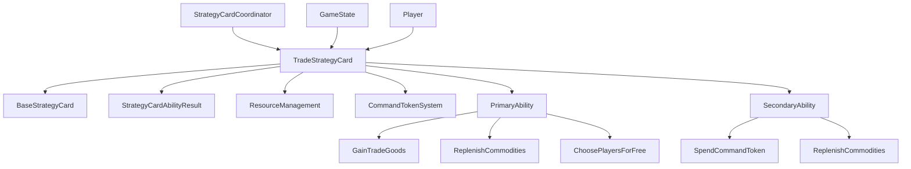

# Design Document - Rule 92: Trade Strategy Card

## Overview

This document provides the technical design for implementing Rule 92: Trade Strategy Card according to the TI4 Living Rules Reference. The Trade strategy card is a critical economic component that allows players to gain trade goods, replenish commodities, and provide economic benefits to other players. This implementation addresses a **CRITICAL BLOCKER** in the economic system by providing the missing essential economic strategy option.

The design leverages the existing strategy card framework established in the codebase and integrates with the resource management system to provide seamless economic gameplay.

## Architecture

### High-Level Architecture



### Component Integration

The Trade strategy card integrates with several existing systems:

1. **Strategy Card Framework**: Inherits from `BaseStrategyCard` and implements standard interfaces
2. **Resource Management**: Integrates with trade goods and commodity systems
3. **Command Token System**: Manages command token costs for secondary abilities
4. **Game State Management**: Updates player resources and tracks card state
5. **Multi-Player System**: Handles player selection and concurrent secondary ability usage

## Components and Interfaces

### Core Components

#### TradeStrategyCard Class

```python
class TradeStrategyCard(BaseStrategyCard):
    """Implementation of the Trade strategy card (LRR Rule 92)."""

    def get_card_type(self) -> StrategyCardType:
        """Returns StrategyCardType.TRADE"""

    def get_initiative_value(self) -> int:
        """Returns initiative value 5"""

    def execute_primary_ability(
        self,
        player_id: str,
        game_state: GameState,
        chosen_players: Optional[List[str]] = None
    ) -> StrategyCardAbilityResult:
        """Executes Trade primary ability with all three steps"""

    def execute_secondary_ability(
        self,
        player_id: str,
        game_state: GameState,
        is_free: bool = False
    ) -> StrategyCardAbilityResult:
        """Executes Trade secondary ability with command token validation"""
```

#### Primary Ability Implementation

The primary ability consists of three sequential steps:

1. **Step 1: Gain Trade Goods**
   ```python
   def _gain_trade_goods(self, player_id: str, game_state: GameState) -> GameState:
       """Award 3 trade goods to the active player"""
   ```

2. **Step 2: Replenish Commodities**
   ```python
   def _replenish_commodities(self, player_id: str, game_state: GameState) -> GameState:
       """Replenish commodities to faction maximum"""
   ```

3. **Step 3: Choose Players for Free Secondary**
   ```python
   def _process_chosen_players(
       self,
       chosen_players: List[str],
       game_state: GameState
   ) -> GameState:
       """Allow chosen players to use secondary ability without cost"""
   ```

#### Secondary Ability Implementation

```python
def _execute_secondary_with_validation(
    self,
    player_id: str,
    game_state: GameState,
    is_free: bool
) -> StrategyCardAbilityResult:
    """Execute secondary ability with proper command token validation"""
```

### Integration Interfaces

#### Resource Management Integration

```python
class ResourceManagementIntegration:
    """Handles integration with resource management system"""

    def add_trade_goods(self, player_id: str, amount: int, game_state: GameState) -> GameState:
        """Add trade goods to player's resource pool"""

    def get_faction_commodity_limit(self, player_id: str, game_state: GameState) -> int:
        """Get player's faction commodity limit"""

    def replenish_commodities_to_max(self, player_id: str, game_state: GameState) -> GameState:
        """Replenish commodities to faction maximum"""
```

#### Command Token Integration

```python
class CommandTokenIntegration:
    """Handles command token validation and spending"""

    def can_spend_strategy_token(self, player_id: str, game_state: GameState) -> bool:
        """Check if player has available strategy command token"""

    def spend_strategy_token(self, player_id: str, game_state: GameState) -> GameState:
        """Spend one command token from strategy pool"""
```

## Data Models

### Trade Strategy Card State

```python
@dataclass
class TradeExecutionState:
    """Tracks state during Trade strategy card execution"""
    active_player_id: str
    chosen_players: List[str]
    trade_goods_gained: int
    commodities_replenished: Dict[str, int]  # player_id -> amount replenished
    command_tokens_spent: Dict[str, int]     # player_id -> tokens spent
```

### Ability Results

```python
@dataclass
class TradeAbilityResult(StrategyCardAbilityResult):
    """Extended result for Trade strategy card abilities"""
    trade_goods_gained: int = 0
    commodities_replenished: int = 0
    chosen_players: List[str] = field(default_factory=list)
    was_free_secondary: bool = False
```

## Error Handling

### Error Types and Handling Strategy

#### Validation Errors

```python
class TradeValidationError(TI4GameError):
    """Raised when Trade strategy card validation fails"""

class InsufficientCommandTokensError(TradeValidationError):
    """Raised when player lacks command tokens for secondary ability"""

class InvalidPlayerSelectionError(TradeValidationError):
    """Raised when invalid players are chosen for free secondary"""
```

#### Error Handling Patterns

1. **Input Validation**: Validate all inputs before processing
2. **Resource Validation**: Check resource availability before spending
3. **State Validation**: Ensure game state consistency
4. **Graceful Degradation**: Return meaningful error messages without crashing

### Error Recovery Strategies

```python
def execute_primary_ability_with_recovery(
    self,
    player_id: str,
    game_state: GameState,
    chosen_players: Optional[List[str]] = None
) -> StrategyCardAbilityResult:
    """Execute primary ability with comprehensive error handling"""
    try:
        # Validate inputs
        self._validate_primary_ability_inputs(player_id, game_state, chosen_players)

        # Execute steps with rollback capability
        return self._execute_primary_steps(player_id, game_state, chosen_players)

    except TradeValidationError as e:
        return StrategyCardAbilityResult(
            success=False,
            error_message=f"Trade primary ability failed: {e}",
            player_id=player_id
        )
```

## Testing Strategy

### Test Coverage Requirements

The implementation must achieve **95%+ test coverage** as specified in the requirements. The testing strategy covers:

#### Unit Tests

1. **Basic Properties Tests**
   - Initiative value validation
   - Card type verification
   - Integration with strategy card system

2. **Primary Ability Tests**
   - Trade goods gain (3 trade goods)
   - Commodity replenishment to faction maximum
   - Player selection for free secondary abilities
   - Step sequencing and integration

3. **Secondary Ability Tests**
   - Command token cost validation
   - Commodity replenishment
   - Free secondary ability execution
   - Multi-player concurrent usage

#### Integration Tests

1. **Strategy Card System Integration**
   - Registration with strategy card coordinator
   - Execution through standard strategy card workflow
   - Initiative order integration

2. **Resource Management Integration**
   - Trade goods tracking and limits
   - Commodity system integration
   - Command token management

3. **Multi-Player Scenarios**
   - Multiple players using secondary ability
   - Player selection and free ability tracking
   - Concurrent execution handling

#### Performance Tests

1. **Execution Time Validation**
   - Primary ability execution < 50ms
   - Secondary ability execution < 25ms
   - Multi-player scenarios < 100ms

2. **Resource Usage Tests**
   - Memory usage during execution
   - Game state size impact
   - Concurrent access performance

### Test Data and Scenarios

#### Test Game States

```python
class TradeTestScenarios:
    """Provides standardized test scenarios for Trade strategy card"""

    @staticmethod
    def create_basic_game_state() -> GameState:
        """Create game state with players having various resource levels"""

    @staticmethod
    def create_multi_player_scenario() -> GameState:
        """Create scenario with multiple players for secondary ability testing"""

    @staticmethod
    def create_resource_limit_scenario() -> GameState:
        """Create scenario testing resource limits and edge cases"""
```

#### Edge Case Testing

1. **Resource Limits**
   - Players at maximum commodity capacity
   - Players with no command tokens
   - Trade goods overflow handling

2. **Player Selection Edge Cases**
   - Choosing all players for free secondary
   - Choosing no players
   - Invalid player ID handling

3. **Concurrent Access**
   - Multiple players executing secondary simultaneously
   - Race condition prevention
   - State consistency validation

## Performance Considerations

### Optimization Strategies

#### Execution Optimization

1. **Batch Resource Updates**: Group resource changes to minimize game state updates
2. **Lazy Validation**: Validate only when necessary to reduce overhead
3. **Caching**: Cache faction commodity limits and other static data

#### Memory Management

1. **Immutable State**: Maintain immutable game state pattern for consistency
2. **Efficient Data Structures**: Use appropriate data structures for player tracking
3. **Garbage Collection**: Minimize object creation during execution

### Performance Targets

- **Primary Ability Execution**: < 50ms
- **Secondary Ability Execution**: < 25ms
- **Multi-Player Scenarios**: < 100ms total
- **Memory Overhead**: < 1MB additional per execution

## Security and Validation

### Input Validation

```python
def _validate_primary_ability_inputs(
    self,
    player_id: str,
    game_state: GameState,
    chosen_players: Optional[List[str]]
) -> None:
    """Comprehensive input validation for primary ability"""

    # Validate player ID
    if not game_state.is_valid_player(player_id):
        raise InvalidPlayerSelectionError(f"Invalid player ID: {player_id}")

    # Validate chosen players
    if chosen_players:
        for chosen_player in chosen_players:
            if not game_state.is_valid_player(chosen_player):
                raise InvalidPlayerSelectionError(f"Invalid chosen player: {chosen_player}")
            if chosen_player == player_id:
                raise InvalidPlayerSelectionError("Cannot choose self for free secondary")
```

### State Consistency

1. **Atomic Operations**: Ensure all resource changes are atomic
2. **Validation Checkpoints**: Validate state consistency at key points
3. **Rollback Capability**: Provide rollback for failed operations

### Access Control

1. **Player Authorization**: Ensure players can only execute abilities they're authorized for
2. **Turn Validation**: Validate that abilities are executed during appropriate game phases
3. **Resource Ownership**: Ensure players can only modify their own resources

## Implementation Plan

### Phase 1: Core Implementation (Week 1)

1. **Day 1-2**: Implement basic TradeStrategyCard class structure
2. **Day 3-4**: Implement primary ability steps (trade goods, commodities)
3. **Day 5**: Implement player selection mechanism
4. **Day 6-7**: Unit tests for core functionality

### Phase 2: Secondary Ability and Integration (Week 2)

1. **Day 1-2**: Implement secondary ability with command token validation
2. **Day 3-4**: Integration with strategy card coordinator
3. **Day 5**: Multi-player support and concurrent execution
4. **Day 6-7**: Integration tests and performance validation

### Phase 3: Quality Assurance and Documentation (Week 3)

1. **Day 1-2**: Comprehensive testing and edge case coverage
2. **Day 3**: Performance optimization and benchmarking
3. **Day 4**: Error handling and validation enhancement
4. **Day 5**: Documentation updates (LRR analysis, roadmap)
5. **Day 6-7**: Final quality assurance and production readiness

## Dependencies and Integration Points

### Required Dependencies

1. **BaseStrategyCard**: Foundation class for strategy card implementation
2. **ResourceManagement**: Trade goods and commodity management
3. **CommandTokenSystem**: Command token validation and spending
4. **GameState**: State management and player tracking
5. **StrategyCardCoordinator**: Strategy card execution coordination

### Integration Validation

1. **Strategy Card Registry**: Ensure Trade card is properly registered
2. **Initiative System**: Validate initiative value 5 integration
3. **Phase Management**: Ensure execution during appropriate game phases
4. **Resource Tracking**: Validate resource changes are properly tracked

## Monitoring and Observability

### Logging Strategy

```python
def execute_primary_ability(self, player_id: str, game_state: GameState, **kwargs) -> StrategyCardAbilityResult:
    """Execute primary ability with comprehensive logging"""
    logger.info(f"Trade primary ability started for player {player_id}")

    try:
        # Log each step
        logger.debug(f"Step 1: Gaining 3 trade goods for player {player_id}")
        new_state = self._gain_trade_goods(player_id, game_state)

        logger.debug(f"Step 2: Replenishing commodities for player {player_id}")
        new_state = self._replenish_commodities(player_id, new_state)

        logger.info(f"Trade primary ability completed successfully for player {player_id}")
        return StrategyCardAbilityResult(success=True, game_state=new_state)

    except Exception as e:
        logger.error(f"Trade primary ability failed for player {player_id}: {e}")
        raise
```

### Metrics Collection

1. **Execution Metrics**: Track execution times and success rates
2. **Resource Metrics**: Monitor resource changes and limits
3. **Usage Metrics**: Track how often Trade card is selected and used
4. **Error Metrics**: Monitor error rates and types

This design provides a comprehensive foundation for implementing Rule 92: Trade Strategy Card while maintaining consistency with existing systems and meeting all specified requirements.
